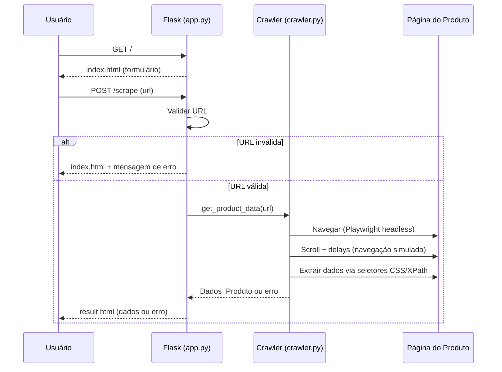
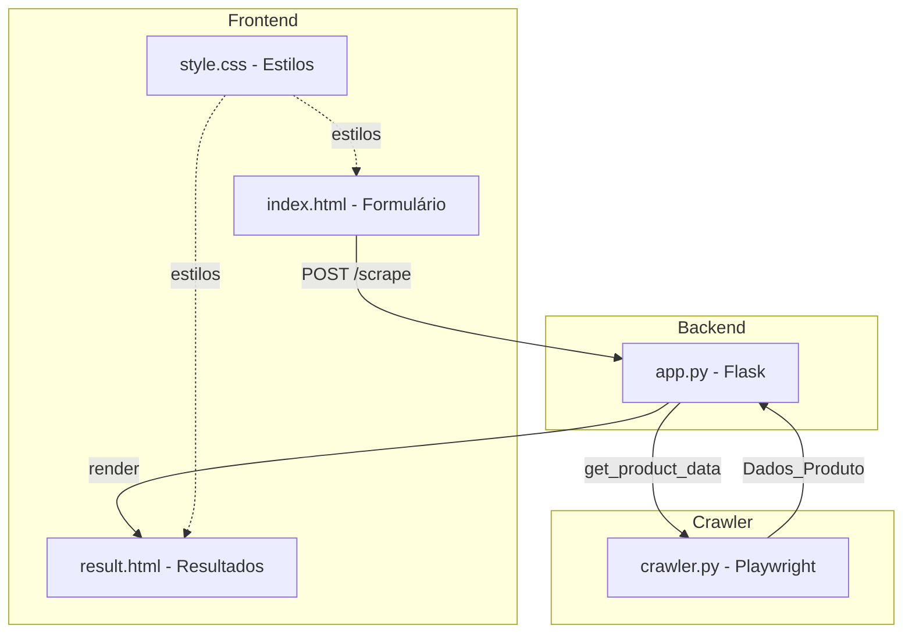
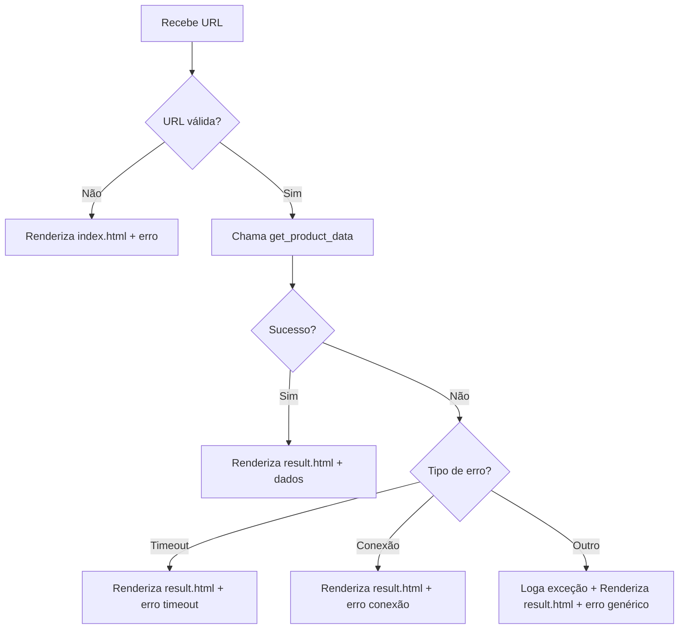

◊# Documento de Design — Product Crawler

## Visão Geral

O Product Crawler é uma aplicação web que permite ao usuário inserir a URL de um produto e obter automaticamente título, preço e descrição extraídos da página. A aplicação é composta por um backend Flask que serve a interface HTML e coordena a execução de um módulo crawler baseado em Playwright. O crawler simula navegação humana (scroll, delays) para garantir que páginas com renderização dinâmica carreguem completamente antes da extração.

### Fluxo Principal



## Arquitetura

A aplicação segue uma arquitetura simples em duas camadas:

1. **Camada Web (app.py)**: Servidor Flask responsável por servir páginas HTML, receber requisições do formulário, validar a URL de entrada e delegar a extração ao módulo crawler. Renderiza templates Jinja2 com os resultados.

2. **Camada de Extração (crawler.py)**: Módulo independente que encapsula toda a lógica de automação do navegador via Playwright. Expõe a função `get_product_data(url)` que gerencia o ciclo de vida do navegador, executa navegação simulada e retorna os dados extraídos.

### Diagrama de Componentes



### Decisões de Design

- **Playwright em modo headless**: Permite executar o navegador sem interface gráfica no servidor, consumindo menos recursos.
- **Navegação simulada**: Scroll e delays entre ações reduzem a chance de detecção como bot e garantem carregamento de conteúdo lazy-loaded.
- **Seletores múltiplos**: O crawler tenta uma lista de seletores CSS/XPath comuns para cada campo (título, preço, descrição), aumentando a compatibilidade com diferentes sites de e-commerce.
- **Timeout de 30 segundos**: Limite razoável para evitar que requisições fiquem pendentes indefinidamente.
- **Separação crawler/backend**: O módulo `crawler.py` não depende do Flask, facilitando testes unitários e reutilização.

## Componentes e Interfaces

### app.py — Backend Flask

```python
# Rotas
@app.route("/")
def index() -> str:
    """Renderiza index.html com o formulário."""

@app.route("/scrape", methods=["POST"])
def scrape() -> str:
    """
    Recebe URL via form POST.
    Valida a URL.
    Chama get_product_data(url).
    Renderiza result.html com dados ou erro.
    """
```

**Funções auxiliares:**

```python
def validate_url(url: str) -> tuple[bool, str]:
    """
    Valida a URL fornecida.
    Retorna (True, "") se válida, ou (False, mensagem_erro) se inválida.
    - URL vazia → erro "URL é obrigatória"
    - URL sem http:// ou https:// → erro "URL inválida"
    """
```

### crawler.py — Módulo de Extração

```python
def get_product_data(url: str) -> dict:
    """
    Função principal do crawler.
    
    Parâmetros:
        url: URL do produto (já validada)
    
    Retorna:
        dict com chaves "title", "price", "description"
        Em caso de erro, retorna dict com chave "error"
    
    Comportamento:
        1. Abre navegador Playwright headless
        2. Navega até a URL com timeout de 30s
        3. Aguarda carregamento do DOM
        4. Executa navegação simulada (scroll + delays)
        5. Extrai dados via seletores CSS/XPath
        6. Fecha o navegador
        7. Retorna Dados_Produto
    """
```

**Constantes e seletores:**

```python
TIMEOUT_MS = 30000  # 30 segundos

TITLE_SELECTORS = [
    "h1.product-title", "h1.product-name", "h1#productTitle",
    "[data-testid='product-title']", "h1", ".product-title"
]

PRICE_SELECTORS = [
    ".price", ".product-price", "#priceblock_ourprice",
    "[data-testid='price']", ".offer-price", "span.price"
]

DESCRIPTION_SELECTORS = [
    ".product-description", "#productDescription",
    "[data-testid='product-description']", ".description",
    "#feature-bullets", "meta[name='description']"
]
```

### Templates HTML

- **index.html**: Formulário com campo `<input name="url">` e botão submit. Exibe mensagem de erro condicional via variável Jinja2 `{{ error }}`.
- **result.html**: Exibe `{{ product.title }}`, `{{ product.price }}`, `{{ product.description }}`. Inclui link "Voltar" para `/`. Exibe mensagem de erro se `{{ error }}` estiver presente.

### static/style.css

Estilos para layout limpo e legível: centralização do conteúdo, tipografia, espaçamento dos campos do formulário e formatação dos dados do produto.

## Modelos de Dados

### Dados_Produto (dict)

```python
# Retorno de sucesso
{
    "title": str,        # Título do produto (string vazia se não encontrado)
    "price": str,        # Preço do produto (string vazia se não encontrado)
    "description": str   # Descrição do produto (string vazia se não encontrado)
}

# Retorno de erro
{
    "error": str         # Mensagem de erro descritiva
}
```

### Validação de URL

| Entrada | Resultado | Mensagem |
|---------|-----------|----------|
| `""` | Inválida | "URL é obrigatória" |
| `"exemplo.com"` | Inválida | "URL inválida" |
| `"http://exemplo.com"` | Válida | — |
| `"https://exemplo.com/produto"` | Válida | — |

### Contexto Jinja2

**index.html:**
```python
{"error": str | None}
```

**result.html:**
```python
{"product": dict | None, "error": str | None}
```

## Propriedades de Corretude

*Uma propriedade é uma característica ou comportamento que deve ser verdadeiro em todas as execuções válidas de um sistema — essencialmente, uma declaração formal sobre o que o sistema deve fazer. Propriedades servem como ponte entre especificações legíveis por humanos e garantias de corretude verificáveis por máquina.*

### Propriedade 1: Validação de URL é consistente com prefixo HTTP/HTTPS

*Para qualquer* string `s`, `validate_url(s)` deve retornar válido se e somente se `s` não é vazia e começa com `"http://"` ou `"https://"`. Strings vazias ou sem esses prefixos devem ser rejeitadas com a mensagem de erro apropriada.

**Valida: Requisitos 2.1, 2.2, 2.3**

### Propriedade 2: Estrutura do Dados_Produto é consistente

*Para qualquer* resultado de sucesso retornado por `get_product_data`, o dicionário deve conter exatamente as chaves `"title"`, `"price"` e `"description"`, e todos os valores devem ser do tipo `str`.

**Valida: Requisitos 4.4, 4.5**

### Propriedade 3: Round-trip de serialização JSON do Dados_Produto

*Para qualquer* dicionário `Dados_Produto` válido (com chaves `"title"`, `"price"`, `"description"` e valores string), `json.loads(json.dumps(dados))` deve produzir um dicionário equivalente ao original.

**Valida: Requisito 5.3**

### Propriedade 4: Mensagens de erro são exibidas na página de resultado

*Para qualquer* string de erro não vazia, ao renderizar o template `result.html` com `{"error": mensagem}`, o HTML resultante deve conter a mensagem de erro.

**Valida: Requisito 6.4**

### Propriedade 5: Dados do produto são exibidos na página de resultado

*Para qualquer* `Dados_Produto` com valores não vazios para título, preço e descrição, ao renderizar o template `result.html` com esses dados, o HTML resultante deve conter o título, o preço e a descrição.

**Valida: Requisito 8.1**

## Tratamento de Erros

### Erros de Validação (app.py)

| Cenário | Comportamento | Resposta |
|---------|---------------|----------|
| URL vazia | `validate_url` retorna erro | Renderiza `index.html` com mensagem "URL é obrigatória" |
| URL sem http/https | `validate_url` retorna erro | Renderiza `index.html` com mensagem "URL inválida" |

### Erros do Crawler (crawler.py)

| Cenário | Exceção Playwright | Comportamento |
|---------|-------------------|---------------|
| Timeout de página | `TimeoutError` | Retorna `{"error": "Timeout: a página não carregou em 30 segundos"}` |
| Falha de conexão | `Error` (connection) | Retorna `{"error": "Falha de conexão: não foi possível acessar a URL"}` |
| Exceção inesperada | Qualquer `Exception` | Loga o erro, retorna `{"error": "Erro inesperado ao processar a página"}` |

### Fluxo de Erros



### Logging

- Nível `INFO`: URL sendo processada, extração concluída com sucesso
- Nível `ERROR`: Tipo de erro + mensagem para qualquer falha no crawler
- Utilizar o módulo `logging` padrão do Python com formato: `%(asctime)s - %(levelname)s - %(message)s`

## Estratégia de Testes

### Biblioteca de Testes

- **Framework**: `pytest`
- **Property-based testing**: `hypothesis`
- **Testes de integração Flask**: `pytest` com `app.test_client()`

### Testes Unitários

Testes unitários focam em exemplos específicos, edge cases e condições de erro:

- **validate_url**: Testar URL vazia, URL sem protocolo, URL com http://, URL com https://
- **Estrutura de templates**: Verificar que `index.html` contém formulário com campo `url` e botão submit
- **Rota GET /**: Verificar status 200 e presença do formulário
- **Rota POST /scrape com URL inválida**: Verificar que retorna `index.html` com mensagem de erro
- **Timeout do crawler**: Verificar constante `TIMEOUT_MS = 30000`
- **Link de retorno**: Verificar que `result.html` contém link para `/`
- **Logging**: Verificar que logs são emitidos nos cenários de início, sucesso e erro

### Testes de Propriedade (Property-Based)

Cada teste de propriedade deve executar no mínimo 100 iterações e referenciar a propriedade do design:

1. **Feature: product-crawler, Property 1: Validação de URL é consistente com prefixo HTTP/HTTPS**
   - Gerar strings aleatórias e verificar que `validate_url` retorna válido ⟺ string não vazia e começa com `http://` ou `https://`

2. **Feature: product-crawler, Property 2: Estrutura do Dados_Produto é consistente**
   - Gerar dicionários `Dados_Produto` aleatórios e verificar que contêm exatamente as chaves esperadas com valores string

3. **Feature: product-crawler, Property 3: Round-trip de serialização JSON do Dados_Produto**
   - Gerar dicionários com chaves `title`, `price`, `description` e valores string aleatórios, serializar com `json.dumps` e deserializar com `json.loads`, verificar igualdade

4. **Feature: product-crawler, Property 4: Mensagens de erro são exibidas na página de resultado**
   - Gerar strings de erro aleatórias, renderizar `result.html` com o erro, verificar que o HTML contém a mensagem

5. **Feature: product-crawler, Property 5: Dados do produto são exibidos na página de resultado**
   - Gerar `Dados_Produto` com valores aleatórios não vazios, renderizar `result.html`, verificar que o HTML contém título, preço e descrição
